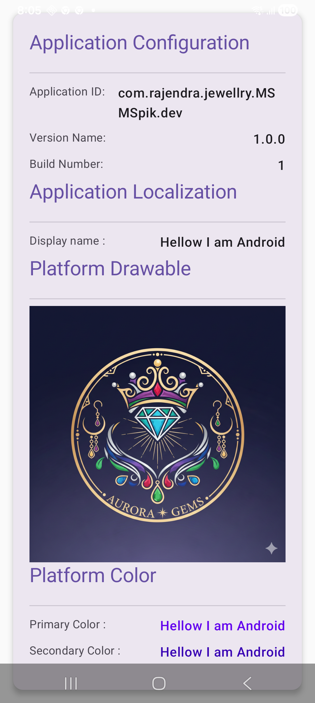
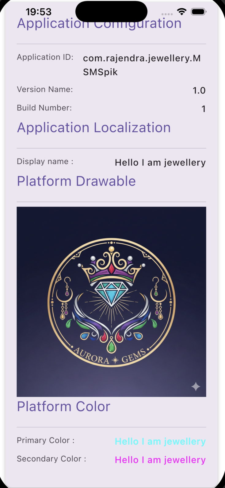

# KMP Showcase Project

This project showcases my Kotlin Multiplatform (KMP) skills. It features a bridge to access images, strings, drawables, and plist values from both Android and iOS platforms.

## Platform Bridge Implementation

This project uses the `expect`/`actual` mechanism to bridge platform-specific resources and configurations to the shared Compose Multiplatform code.

### Common Interface (`commonMain`)

The `PlatformBridge.kt` defines the expected functions:

- `expect fun getPlatform(): AppConfig`: Retrieves app configuration (version, name, etc.).
- `expect fun getDrawable(): AppDrawable`: Retrieves platform-specific drawables (e.g., logo).
- `expect fun getThemColor(): ThemeColor`: Retrieves platform-specific theme colors.

### Android Implementation (`androidMain`)

The Android implementation leverages standard Android resources:

- **Configuration**: Accesses `AndroidApp` context.
- **Drawables**: Uses `painterResource(R.drawable.tenant_logo)` to load images from the `res/drawable` folder.
- **Colors**: Uses `colorResource(R.color.primary)` to load colors from `res/values/colors.xml`.

### iOS Implementation (`iosMain`)

The iOS implementation interacts with native iOS frameworks:

- **Configuration**: Reads from `NSBundle.mainBundle.infoDictionary` to access `Info.plist` values (e.g., `CFBundleShortVersionString`).
- **Drawables**: Loads images using `UIImage.imageNamed("tenant_logo")` from the Asset Catalog and converts them to Compose `ImageBitmap`.
- **Colors**: Loads colors using `UIColor.colorNamed("primary")` from the Asset Catalog and converts them to Compose `Color`.

## Screenshots

| Android | iOS |
|:---:|:---:|
|  |  |

- [/composeApp](./composeApp/src) is for code that will be shared across your Compose Multiplatform applications.
  It contains several subfolders:
  - [commonMain](./composeApp/src/commonMain/kotlin) is for code that’s common for all targets.
  - Other folders are for Kotlin code that will be compiled for only the platform indicated in the folder name.
    For example, if you want to use Apple’s CoreCrypto for the iOS part of your Kotlin app,
    the [iosMain](./composeApp/src/iosMain/kotlin) folder would be the right place for such calls.
    Similarly, if you want to edit the Desktop (JVM) specific part, the [jvmMain](./composeApp/src/jvmMain/kotlin)
    folder is the appropriate location.

- [/iosApp](./iosApp/iosApp) contains iOS applications. Even if you’re sharing your UI with Compose Multiplatform,
  you need this entry point for your iOS app. This is also where you should add SwiftUI code for your project.

### Build and Run Android Application

To build and run the development version of the Android app, use the run configuration from the run widget
in your IDE’s toolbar or build it directly from the terminal:

- on macOS/Linux

  ```shell
  ./gradlew :composeApp:assembleDebug
  ```

- on Windows

  ```shell
  .\gradlew.bat :composeApp:assembleDebug
  ```

### Build and Run iOS Application

To build and run the development version of the iOS app, use the run configuration from the run widget
in your IDE’s toolbar or open the [/iosApp](./iosApp) directory in Xcode and run it from there.

---

Learn more about [Kotlin Multiplatform](https://www.jetbrains.com/help/kotlin-multiplatform-dev/get-started.html)…
.
